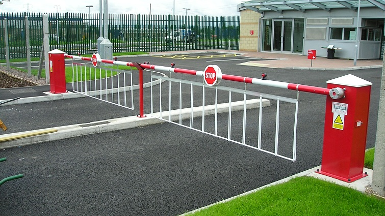

## Barrier / Gate Detection

### Training

Clone the research models repository of tensorflow

```bash

git clone https:/github.com/tensorflow/models

cd models/research/object_detection/

```

**Install models directory on to your root project folder**


```bash

docker-compose up -d build

```

__Training the Dataset using tensorflow__

```bash

python model_main_tf2.py -- \
  --model_dir=$MODEL_DIR --num_train_steps=$NUM_TRAIN_STEPS \
  --sample_1_of_n_eval_examples=$SAMPLE_1_OF_N_EVAL_EXAMPLES \
  --pipeline_config_path=$PIPELINE_CONFIG_PATH \
  --alsologtostderr

```

__Create Pipeline Config__

```python

from object_detection.utils import config_util

config_util.get_configs_from_pipeline_file(pipeline_config_path='<dirname>')

```

__Create Dataset of Barrier Images__

```bash

cd bing_image_downloader/

python setup.py install

```

```python

from bing_image_downloader import downloader
downloader.download(query_string, limit=100,  output_dir='dataset', adult_filter_off=True, force_replace=False, timeout=60)

```

#### Download existing MSCOCO Dataset

```bash

cd /home/tensorflow/models/research/object_detection/dataset_tools/ bash ./download_and_preprocess_mscoco.sh /home/tensorflow/output_dir

```

__Image Annotation__

**CVAT (Computer Vision Annotation Toolkit) does the Image Annotation on training data. Training data of barrier images consists of some hundreds of images.**

__Model Inference Tests__

```bash

git clone https://github.com/nscalo/pytorch2tensorflow
cd pytorch2tensorflow
python3 inception_v3.py
mv resnet18.onnx inception_v3.onnx

```

__Model Conversion__

```bash

:/opt/intel/openvino/deployment_tools/model_optimizer# python3 mo_onnx.py --input_model /home/project/sample_models/inception_v3.onnx --input_shape [1,3,299,299] --input "data" --output "prob" --data_type FP32 --output_dir /home/project/models

```

__Inference Results__

[ INFO ] Creating Inference Engine
[ INFO ] Loading network files:
        /home/project/models/inception_v3/inception_v3.xml
        /home/project/models/inception_v3/inception_v3.bin
[ INFO ] Preparing input blobs
[ WARNING ] Image /home/project/samples/image1.jpg is resized from (675, 900) to (299, 299)
[ INFO ] Batch size is 1
[ INFO ] Loading model to the plugin
[ INFO ] Starting inference in synchronous mode
[ INFO ] Processing output blob
[ INFO ] Top 10 results:
Image /home/project/samples/image1.jpg

classid probability
------- -----------
  725     18.9454308
  110     14.7835197
  883     14.5714207
  916     13.1352987
  447     12.6553574
  773     12.4970264
  982     11.1883326
  979     11.0661860
  614     9.8136787
  818     9.0564919

[ INFO ] Creating Inference Engine
[ INFO ] Loading network files:
        /home/project/models/inception_v3/inception_v3.xml
        /home/project/models/inception_v3/inception_v3.bin
[ INFO ] Preparing input blobs
[ WARNING ] Image /home/project/samples/image2.jpg is resized from (408, 868) to (299, 299)
[ INFO ] Batch size is 1
[ INFO ] Loading model to the plugin
[ INFO ] Starting inference in synchronous mode
[ INFO ] Processing output blob
[ INFO ] Top 10 results:
Image /home/project/samples/image2.jpg

classid probability
------- -----------
  916     26.1904640
  502     23.3235359
  110     22.1218090
  447     21.4066143
  614     16.5020027
  725     15.7865076
  773     15.5626106
  836     15.5608282
  659     15.1746807
  386     14.1328096

**image1.jpg**


**image2.jpg**


**image3.jpg**


**image4.jpg**


**So the classes with top probabilities I get from inferences are:**

**Sea Anemone, Pirate, Safe, Pinwheel, etc**

_Training is found to be required_

### Training Pipeline for Object Detection

